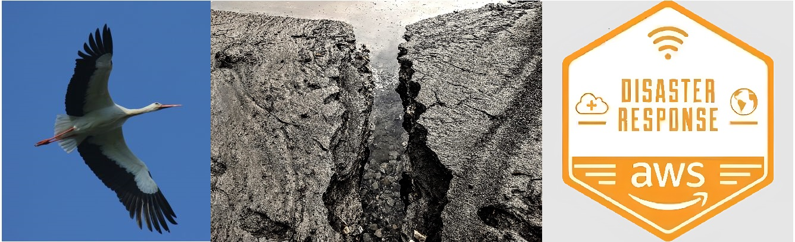

<div id="top"></div>
<!--
*** Thanks for checking out the Best-README-Template. If you have a suggestion
*** that would make this better, please fork the repo and create a pull request
*** or simply open an issue with the tag "enhancement".
*** Don't forget to give the project a star!
*** Thanks again! Now go create something AMAZING! :D
-->


<!-- PROJECT SHIELDS -->
<!--
*** I'm using markdown "reference style" links for readability.
*** Reference links are enclosed in brackets [ ] instead of parentheses ( ).
*** See the bottom of this document for the declaration of the reference variables
*** for contributors-url, forks-url, etc. This is an optional, concise syntax you may use.
*** https://www.markdownguide.org/basic-syntax/#reference-style-links


<!-- PROJECT LOGO -->
<br />
<div align="center">
  <a href="https://github.com/Ashoka74/EQ_Forecast">
    
  </a>

<h3 align="center">Migratory Birds for Earthquake Forecasting</h3>

  <p align="center">
    Migratory birds such are magneto-receptive animals. We believe that they can feel subtle geo-magnetic anomalies in the ULF band-width a few days prior to earthquakes. 
    Using Supervised-Learning, we fed a B-LSTM with daily White Stork behaviour in order to predict earthquake imminence.
    <br />
    <a href="https://github.com/Ashoka74/EQ_Forecast"><strong>Explore the docs »</strong></a>
    <br />
    <br />
    <a href="https://youtu.be/I_iIZmXBTDk">View Demo</a>
    ·
    <a href="https://github.com/Ashoka74/EQ_Forecast/issues">Report Bug</a>
    ·
    <a href="https://github.com/Ashoka74/EQ_Forecast/issues">Request Feature</a>
  </p>
</div>


<!-- TABLE OF CONTENTS -->
<details>
  <summary>Table of Contents</summary>
  <ol>
    <li>
      <a href="#about-the-project">About The Project</a>
      <ul>
        <li><a href="#built-with">Built With</a></li>
      </ul>
    </li>
    <li>
      <a href="#getting-started">Getting Started</a>
      <ul>
        <li><a href="#prerequisites">Prerequisites</a></li>
        <li><a href="#installation">Installation</a></li>
      </ul>
    </li>
    <li><a href="#usage">Usage</a></li>
    <li><a href="#roadmap">Roadmap</a></li>
    <li><a href="#contributing">Contributing</a></li>
    <li><a href="#license">License</a></li>
    <li><a href="#contact">Contact</a></li>
    <li><a href="#acknowledgments">Acknowledgments</a></li>
  </ol>
</details>


<!-- ABOUT THE PROJECT -->
## About The Project

[![Product Name Screen Shot][product-screenshot]](https://example.com)


<p align="right">(<a href="#top">back to top</a>)</p>


### Built With

* [R](https://www.r-project.org/)
* [Python](https://www.python.org/)
* [SageMaker Studio](https://studiolab.sagemaker.aws/)


<p align="right">(<a href="#top">back to top</a>)</p>


<!-- GETTING STARTED -->
## Getting Started

This is an example of how you may give instructions on setting up your project locally.
To get a local copy up and running follow these simple example steps.

### Prerequisites

You should have Python already installed.

If using another editor from SageMaker Studio
* Create a Virtual Environment in the root folder
  ```sh
  python -m venv .venv
  ```

### Installation

1. Open SageMakerStudios (with GPU) or go in your local environment folder
2. Clone the repo from a notebook directly:
   ```sh
   !git clone https://github.com/Ashoka74/EQ_Forecast.git
   
   ```
3. Install required packages
   ```sh
   !pip install -r requirements.txt
   ```
4. Run the blstm_presentation notebook

<p align="right">(<a href="#top">back to top</a>)</p>


<!-- USAGE EXAMPLES -->
## Usage

To understand the Model: 
[Model: https://youtu.be/Je__3TKdURU](https://youtu.be/Je__3TKdURU)

The following video will get you through the code: 
[Code: https://youtu.be/I_iIZmXBTDk](https://youtu.be/I_iIZmXBTDk)


<p align="right">(<a href="#top">back to top</a>)</p>


<!-- LICENSE -->
## License

Distributed under the GNU License. See `LICENSE.txt` for more information.

<p align="right">(<a href="#top">back to top</a>)</p>


<!-- CONTACT -->
## Contact

Sinan Robillard - sinanrobillard@gmail.com

Project Link: [https://github.com/Ashoka74/EQ_Forecast.git](https://github.com/Ashoka74/EQ_Forecast.git)

<p align="right">(<a href="#top">back to top</a>)</p>


<!-- THE TEAM -->
## The Team

* [Sinan Robillard](@Ashoka74)
* [Marco Fernandez](@@marcofer-fernandez)
* [Ojavsi Gupta](@ojasviG)

<p align="right">(<a href="#top">back to top</a>)</p>


<!-- MARKDOWN LINKS & IMAGES -->
<!-- https://www.markdownguide.org/basic-syntax/#reference-style-links -->
[contributors-shield]: https://img.shields.io/github/contributors/Ashoka74/EQ_Forecast.svg?style=for-the-badge
[contributors-url]: https://github.com/Ashoka74/EQ_Forecaste/graphs/contributors
[forks-shield]: https://img.shields.io/github/forks/Ashoka74/EQ_Forecast.svg?style=for-the-badge
[forks-url]: https://github.com/Ashoka74/EQ_Forecast/network/members
[stars-shield]: https://img.shields.io/github/stars/Ashoka74/EQ_Forecast.svg?style=for-the-badge
[stars-url]: https://github.com/Ashoka74/EQ_Forecast/stargazers
[issues-shield]: https://img.shields.io/github/issues/Ashoka74/EQ_Forecast.svg?style=for-the-badge
[issues-url]: https://github.com/Ashoka74/EQ_Forecast/issues
[license-shield]: https://img.shields.io/github/license/Ashoka74/EQ_Forecast.svg?style=for-the-badge
[license-url]: https://github.com/Ashoka74/EQ_Forecast/blob/master/LICENSE.txt
[linkedin-shield]: https://img.shields.io/badge/-LinkedIn-black.svg?style=for-the-badge&logo=linkedin&colorB=555
[linkedin-url]: www.linkedin.com/in/sinan-robillard
[product-screenshot]: images/screenshot.png
